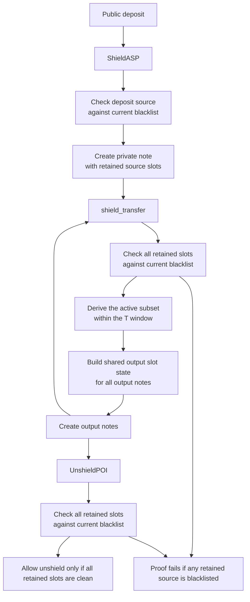
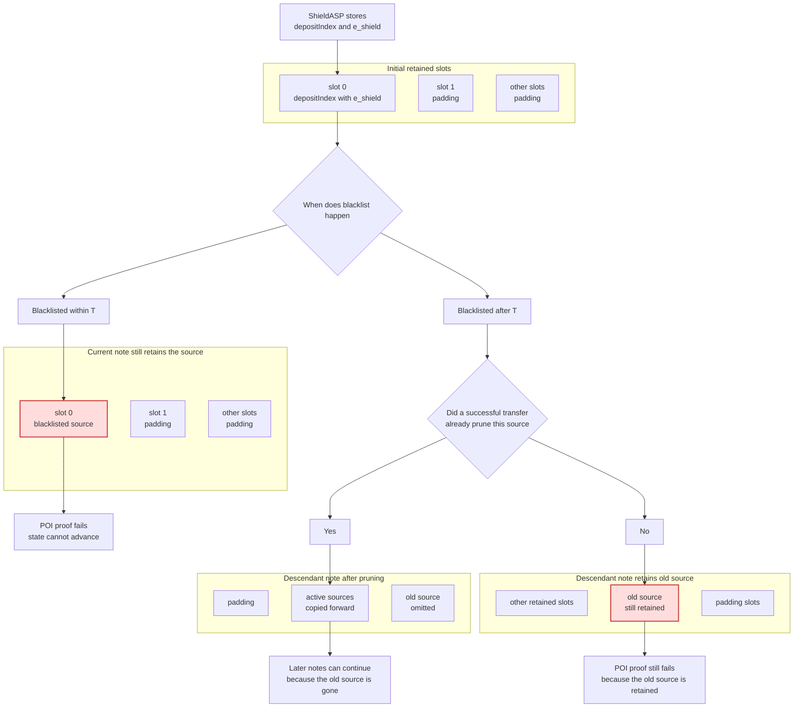

# Time-bounded retained-source PoI model
## Terminology defination
## Background
For a compliance-oriented privacy system, a PoI-based design is attractive because it allows a user to prove that the funds currently being spent are not linked to blacklisted protocol-entry sources. The main drawback of a naive PoI design is that every note would need to carry an unbounded lineage of historical sources. As the private transfer graph becomes deeper and more entangled, witness size, proof cost, and on-chain or off-chain source-state storage all grow quickly.

The time-bounded retained-source PoI model addresses this by replacing unbounded lineage retention with a fixed-size retained source set. Each note stores at most `K` retained source slots, and transfer semantics only copy forward the sources that are still active within the last `T` epochs. At the same time, the current retained-slot strict rule is stronger than a simple "only check the last `T` epochs" model: any source that is still retained in the current note must still pass the blacklist non-membership check, even if it is already older than `T`. A source stops affecting future proofs only after a successful transfer prunes it from descendant notes. This keeps the state and proof size bounded while still preserving a meaningful compliance guarantee.

| Dimension | Full-lineage PoI | Time-bounded retained-source PoI |
|---|---|---|
| Source state per note | - Carries the full historical source lineage - State grows with transfer depth and merge history | - Carries at most `K` retained source slots - State stays bounded by construction |
| Proof cost | - Grows with lineage depth - Grows further as merged history becomes more complex | - Scales with bounded retained slots - Stays within fixed circuit limits |
| Storage cost | - Retains growing lineage metadata - Off-chain or on-chain source state keeps expanding | - Stores bounded note state - Uses bounded witness inputs |
| Compliance | - Blocks spending if any source in the full historical lineage is blacklisted at verification time - Late blacklist additions are still caught because the source remains in the lineage | - ASP blocks newly entering blacklisted sources, and retained-slot checks block blacklisted sources while they are still retained in descendant notes - A source first blacklisted only after it has aged past `T` and has already been pruned may be missed |

## Solution

The time-bounded retained-source PoI model uses time-bounded source retention with retained-slot strict verification:

- `T` only decides which sources are copied into newly created output notes.
- `shield_transfer` and `unshield` must still check every source slot currently retained in the note state.
- A source stops affecting future proofs only after a successful transfer prunes it from descendant notes.

### High-Level Flow

### Retained Slot State And Outcomes

### Circuit Note

The chart above shows the semantic goal, not a literal in-circuit sorting algorithm.

- `Canon_e(U_raw)` is the spec-level meaning of the desired output slot state.
- In the actual circuit, the prover proposes `Slots_out` off-circuit.
- The circuit only checks that `Slots_out` is correct and canonical:
  - every live input source is covered
  - `Slots_out` is well formed
  - duplicate live sources collapse to one output slot
  - all output notes share the same `Slots_out`

So the circuit does not need to implement a generic `sort + unique` gadget internally. It only needs to constrain the witness-provided output so that it already matches the canonical active source set.

## References
- [Detailed spec[ZH]](https://github.com/dajuguan/privacy/blob/main/overview_poi.md)
- [PoC implementation](https://github.com/dajuguan/privacy)